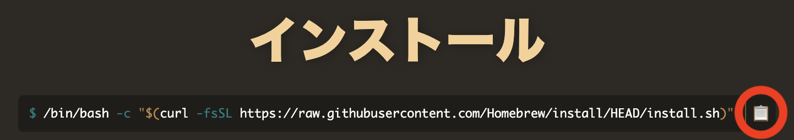

# 1. はじめに

下川研では研究活動を行う際に、様々なソフトウェアを利用する。
代表的なものとして以下のようなものがある。

- Visual Studio Code : 汎用エディタ
- Git : ソフトウェアのバージョン管理
- GitHub Desktop : Git 用 GUI
- Docker Desktop : コンテナ実行環境

# 2. インストールするもの

ここでは、以下のソフトウェアのインストール方法を説明する。
また、Windows と Mac 用のインストール方法を説明する。
自分が使っている PC の環境に合わせて作業をすること。

- パッケージ管理ソフト
  - WinGet (Windows の場合)
  - Homebrew (Mac の場合)
- Visual Studio Code
- Git
- GitHub Desktop
  - これに先立って GitHub のアカウント作成についても説明する
- Docker Desktop

# 3. パッケージ管理ソフト

各種ソフトウェアを管理するのに、パッケージ管理ソフトと呼ばれるソフトウェアを利用する。
これにより様々なソフトウェアの管理を一元化する。
パッケージ管理ソフトは、パッケージマネージャと呼ばれることもある。

Windows では  *WinGet* , Mac では *Homebrew* というパッケージ管理ソフトを利用する。

パッケージ管理ソフトを使ってコマンドラインでインストール作業を行う。
最初のうちは、コマンド入力が大変に感じるかもしれない。
しかし、慣れてくると分かるが GUI で操作するよりも、
コマンドラインで操作するほうが再現性が高く、間違いが少ない。

## 3.1 Windows : WinGet

- Windows 11 では WinGet は標準でインストール済みなので作業は不要

## 3.2 Mac : Homebrew

1. `ターミナル` を実行する
 1. **ドック** から `アプリ` を実行
 1. `ターミナル` を実行
1. [HomeBrew本家](https://brew.sh/ja/) の以下の右端の赤い◯で囲まれた部分をクリックし、インストール用コマンドラインをコピーする
    
1. ターミナル上に貼り付ける
 - ウィンドウ上で **`Command-v Enter`** を入力
 - この後 **Password:** と表示されたら、mac のログインパスワードを入力
 - Press **Return/Enter** to continue or any other key to abord: と表示されたら `Enter` キーを叩く
1. Homebrew のインストールが終了するので、以下を実行し、Homebrew を有効化する
```
echo >> ~/.zprofile
echo 'eval "$(/opt/homebrew/bin/brew shellenv)"' >> ~/.zprofile
eval "$(/opt/homebrew/bin/brew shellenv)"
```

# 4. Visual Studio Code

Visual Studio Code(以下 VSCode) は汎用エディタである。

## 4.1 Windowsの場合

- PowerShell 上で以下を実行
  ```
  winget install -e --id Microsoft.VisualStudioCode --source winget
  ```

## 4.2 Mac の場合
       
- ターミナル上で以下を実行
  ```
  brew install --cask visual-studio-code
  ```

## 4.3 日本語化
VScode インストール後、[この記事](https://www.atmarkit.co.jp/ait/articles/1805/18/news032.html)を参考に表示言語を日本語にしておくと便利かもしれない。
英語表示のまま使っても何も問題はない


# 5. Git

## 5.1 Windows

- PowerShell 上で以下を実行
  ```
  winget install --id Git.Git -e --override "/VERYSILENT /NORESTART /NOCANCEL /SP- /o:EditorOption=VisualStudioCode /o:SSHOption=ExternalOpenSSH /o:CRLFOption=LFOnly"
  ```

## 5.2 Mac

- Mac は標準でも Git がインストールされているが、バージョンが古い。 そこで Homebrew を使い最新版の Git をインストールする。
- ターミナル上で以下を実行する
  ```
  brew install git
  ```

# 6. GitHub

Git では中央リポジトを利用する。
下川研では中央リポジトリとして GitHub.com のサービスを利用する。
そこで [このドキュメント](github-account.pdf)に従って GitHub のアカウントを登録する

<!--
下川研では、GitHub に [smkwlab organization](https://github.com/smkwlab/)を作成し、
共同作業に利用している。
この登録作業は下川にしか出来ないので、登録した GitHub アカウントを、下川まで連絡する。
-->

# 7. GitHub Desktop

Git や GitHub を操作するための GUI として GitHub Desktop を使う。
本来はコマンドラインの使い方を覚えてほしいが、まずは使えるようになることが先決。

## 7.1 Windows の場合

- PowerShell 上で以下を実行
  ```
  winget install -e --id GitHub.GitHubDesktop
  ```

## 7.2 Mac の場合

- ターミナル上で以下を実行
  ```
  brew install --cask github
  ```

# 8. Docker Desktop

Docker Desktop はコンテナ実行環境である。

## 8.1 Windows の場合

- PowerShell 上で以下を実行
  ```
  winget install -e --id Docker.DockerDesktop --source winget
  ```

## 8.2 Mac の場合

- ターミナル上で以下を実行
  ```
  brew install --cask docker
  ```
