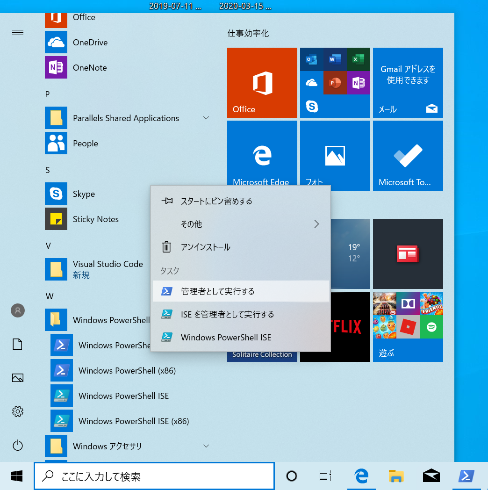

## はじめに

下川研では研究活動を行う際に、様々なソフトウェアを利用する。
代表的なものとして以下のようなものがある。

- Git : ソフトウェアのバージョン管理
- GitHub Desktop : Git 用 GUI
- Visual Studio Code : 汎用エディタ

## インストールするもの

ここでは、以下のソフトウェアのインストール方法を説明する。
また、Windows と Mac 用のインストール方法を説明する。
自分が使っている PC の環境に合わせて作業をすること。

- パッケージ管理ソフト
 - Chocolatey (Windows の場合)
 - Homebrew (Mac の場合)
- Git
- GitHub Desktop
 - これに先立って GitHub のアカウント作成についても説明する
- Visual Studio Code

## パッケージ管理ソフトのインストール

各種ソフトウェアを管理するのに、パッケージ管理ソフトと呼ばれるソフトウェアを利用する。
これにより様々なソフトウェアの管理を一元化する。
パッケージ管理ソフトは、パッケージマネージャと呼ばれることもある。

Windows では  Chcolatey というパッケージ管理ソフトを利用する。

Mac では Homebrew というパッケージ管理ソフトを利用する。

### Windows : Chocolatey

1. PowerShell を管理者権限で実行する
 1. Windows メニューから Windows Power Shell のメニューを開く
 1. Windows Power Shell という項目の上で右クリックし、**管理者として実行する**をクリック
   
 1. Chcolatey本家の[インストール情報ページ](https://chocolatey.org/install#installing-chocolatey)の、以下の右端の青い○で囲まれた部分をクリックし、インストール用コマンドラインをコピーする
    
 1. PowerShell ウィンドウ上に貼り付ける
 - ウィンドウ上で **`Ctrl-v  Enter`** を入力
 - これで Chcolatey のインストールが完了

### Mac : Homebrew

1. [この記事](https://qiita.com/rabbit1013/items/1494cf345ff172c3b9cd)を参考に Homebrew をインストールする

## Git

### Windows

- 管理者権限で起動した PowerShell 上で **`choco install -y git`** を実行し、git をインストールする

### Mac

- Mac は標準でも Git がインストールされているが、バージョンが古い。 そこで Home Brew を使い最新版の Git をインストールする。
- ターミナル上で **`brew install git`** を実行する

## GitHub

Git では中央リポジトを利用する。
下川研では中央リポジトリとして GitHub.com のサービスを利用する。
そこで  GitHub.com のアカウントを取得する。次に Git および GitHub の GUI である GitHub Desktop をインストールする。

### GitHub アカウント

[このドキュメント](github-account.pdf)に従ってアカウントを登録する

##GitHub Desktop

Git や GitHub を操作するための GUI として GitHub Desktop を使う。
本来はコマンドラインの使い方を覚えてほしいが、まずは使えるようになることが先決。

### Windows の場合

- 管理者権限の PowerShell 上で **`choco install -y github-desktop`** を実行

### Mac の場合

- ターミナル上で **`brew cask install github`** を実行

