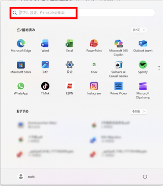
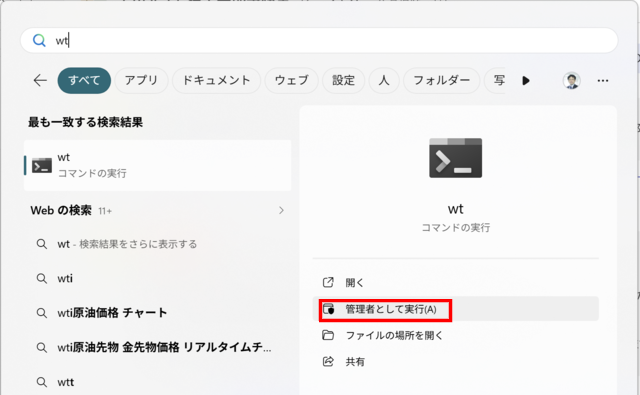

# 1. 説明を読み飛ばして、とりあえず全部インストールしたい場合

全てまとめてインストールするプログラムを用意した。
ただ、インストール後でも良いので、 [元のドキュメント](.) 全体には目を通しておこう。

## 1.1 Windows の場合

- wsl をインストール

1. **スタートメニュー** の **アプリ,設定,ドキュメントの検索** に `wt` と入力

    
2. `管理者として実行(A)` をクリック

    
3. **このアプリがデバイスに変更を加えることを許可しますか？** というダイアログに対しては `はい` をクリック

- 開いたターミナルで以下を実行。なお、実行後 Windows の再起動が必要。
    ```
wsl --install --no-distribution
    ```
- 残りをインストール

[pcenv-setup-all.bat](pcenv-setup-all.bat) をダウンロードして実行。

## 1.2 Mac の場合

[pcenv-setup-all.sh](pcenv-setup-all.sh) をダウンロードして実行。
